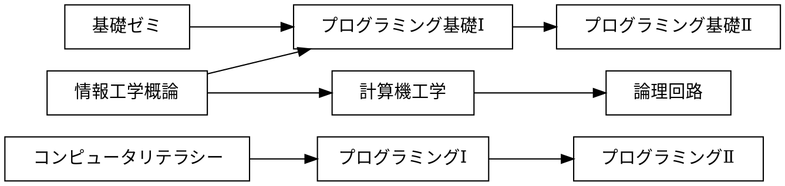

# 課題

## 課題 3.1 有向グラフ


プレビュー結果が上の図のようになるように，下記の記述を完成させよ．(接続関係が正しければ，上下が入れ替わっても構わない)

※ 日本語の文字列に対する箱の大きさが適切でない場合には，前後に空白を入れて調整せよ



## 課題 3.2 WBS


プレビュー結果が上の図のようになるように，下記の記述を完成させよ．(色や影などの違いは気にしなくてよい)

```plantUML
@startwbs ex02
* 拓殖大学
** 商学部
*** 経営学科
*** 国際ビジネス学科
*** 会計学科
** 政経学部

*** 法律政治学科
*** 経済学科
** 外国語学部
*** 英米語学科
*** 中国語学科
*** スペイン語学科
*** 国際日本語学科
** 工学部
*** 機械システム工学科
*** 電子システム工学科
*** 情報工学科
*** デザイン学科
** 国際学部
*** 国際学科
@endwbs
```

## 課題 3.3 ユースケース図


プレビュー結果が上の図のようになるように，下記の記述を完成させよ．ただし，別名については適当に設定してよい．(色や影などの違いは気にしなくてよい)

```plantUML
@startuml ex03
left to right direction
actor 学生 as student
actor 教員 as teacher
rectangle {
    usecase "提出結果の採点" as graSub
    usecase "リモートリポジトリにpush" as pusRip
    usecase "修正のコミット" as comCor
    usecase "修正をステージに上げる" as upCor
    usecase "課題ファイルの修正" as modSub
    usecase "リポジトリのクローン" as cloRip
    usecase "課題の受領" as getSub
    usecase "課題の登録" as setSub
}
graSub <-- teacher
student --> pusRip
student --> comCor
student --> upCor
student --> modSub
student --> cloRip
student --> getSub
setSub <-- teacher
@enduml
```

## 課題 3.4 オリジナルの図解

「有向グラフ」「WBS」「ユースケース図」のどれかを使って，
独自の図解を作成せよ．対象は自由に決めてよいが，
誰かのコピーにならないように留意せよ．

```plantUML
@startuml ex04
left to right direction
actor 店員 as staff
actor 客 as costomer
rectangle {
    usecase "「ありがとございました。またお願いします」と言う" as sayThx
    usecase "会計を済ませる" as finCsh
    usecase "画面から会計方法を選ぶ" as chsCsh
    usecase "画面の会計ボタンを押す" as pusCsh
    usecase "ポイントカードのバーコードを読み取る" as scnCad
    usecase "ポイントカードを持っているか聞く" as askCad
    usecase "受けとった座席表のQRを読み取る" as scnQr
    usecase "座席表を渡す" as givQr
}
staff --> sayThx
finCsh <-- costomer
chsCsh <-- costomer
staff --> pusCsh
staff --> scnCad
staff --> askCad
staff --> scnQr
givQr <-- costomer
@enduml
```


## チェック
- [ ] 課題 3.1 有向グラフ
- [ ] 課題 3.2 WBS
- [ ] 課題 3.3 ユースケース図
- [ ] 課題 3.4 オリジナルの図解
